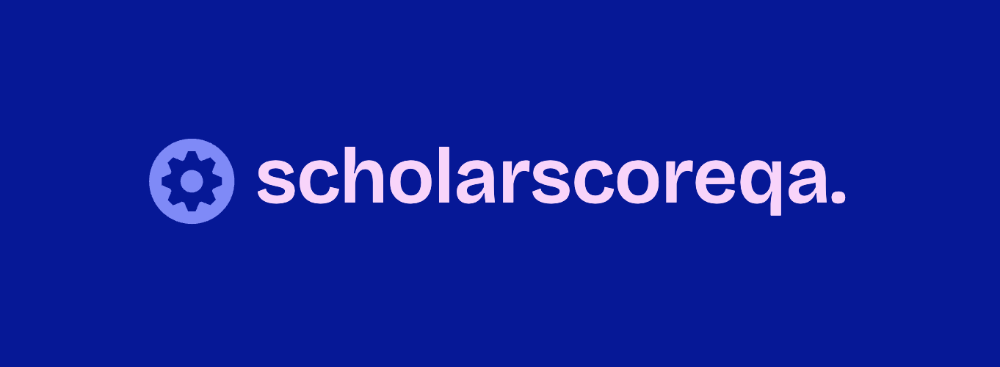

  

# 📘 ScholarScoreQA: Reliable Scholarly Question Answering

  
  
  
  

  
  
  
  
  
  

  
  
  

A **retrieval-augmented scholarly question-answering system** designed for long research articles. ScholarScoreQA integrates:

* **K-Span Select** — a span-level retrieval mechanism that filters only the most relevant evidence.
* **Multi-dimensional evaluation** using a **Language Judge**, **Tone Judge**, and a unified metric called **ScholarScore**.
* **Multiple prompting strategies** (Zero-shot, CoT, Few-shot, Meta-prompting) to generate diverse answer candidates.

This repository accompanies the paper:

> **K-Span Select and Multi-Dimensional Judging for Reliable Scholarly Question Answering**
> *Preetam Pati, Sayan De, Saurabh Tiwari, Imon Mukherjee, Debarshi Kumar Sanyal*
> *IIIT Kalyani & IACS Kolkata*

---

## 🚀 Overview

Long scholarly documents present challenges for QA:

* Evidence is often **scattered** across sections.
* Retrieval systems can fetch **irrelevant text**, confusing LLMs.
* LLM-generated answers may be **fluent but hallucinated**.

**ScholarScoreQA** addresses this through:

1. **Span-level Context Engineering** via K-Span Select.
2. **Diverse LLM prompting** to generate candidate answers.
3. **Two independent judge modules** to ensure factual and stylistic reliability.
4. **ScholarScore**, a harmonic metric to pick the best final answer.

---

📘 **Repo Structure (Auto-updated)**  
See **REPO_TREE.txt** in the root directory.